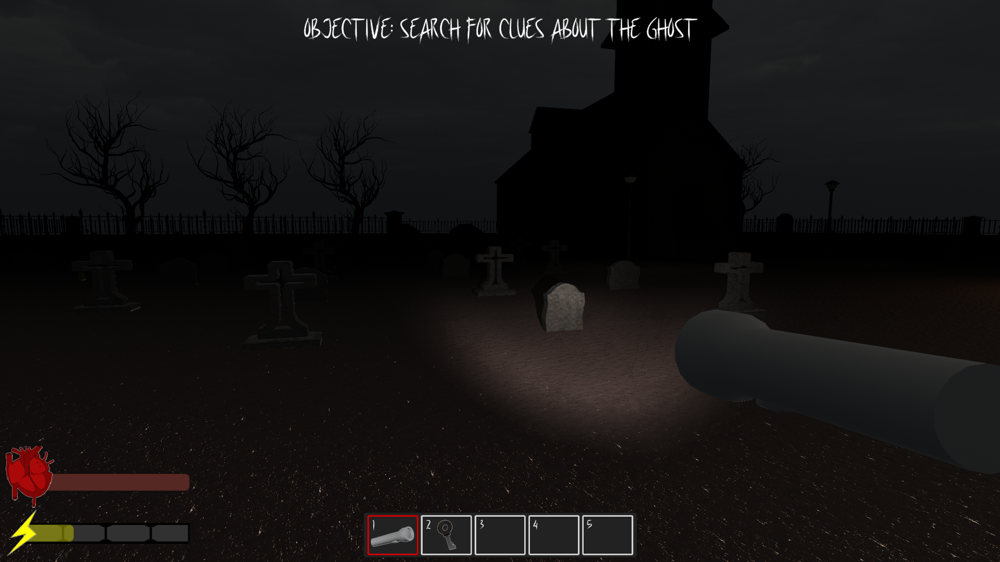

# The Departed - Game Development (Level 3) Coursework Project

## Overview 
As part of my **Game Development (Level 3) course** I pitched an idea for a horror game which was voted to be worked on as our final group project. We created our game in Unity, whilst using *Visual Studio* as our integrated development environment (IDE), and used *GitHub* for version control. Whilst working on the project I had to ensure to document the planning, designing, implementation, testing and evaluation phases. 

The Departed is a horror game set in a world in which supernatural and paranormal activity often occur. In the game the player will explore a variety of eerie locations - including cemeteries and haunted houses - to exorcise phantoms and restore balance to the natural order. 

----

## Current Game Features
- Consists of one fully functional, complete level.
- Players can freely explore the environment and complete mandatory objectives.
- A working inventory system for item management, allowing the player to select and use tools or items.
- A fully functional heads up-display (HUD).
- An enemy AI, which is powered by a finite state machine (FSM), that detects, pursues, chases or flees from the player.
- A torch mechanic, allowing the player to emit a light from their torch using a *RayCast* and a *trigger*, which deters the enemy AI if shone upon within a particular range.

----

## Technical Contributions
- **Data Structures**: Implemented different *data structures* (including *2D arrays* and *enums*) to manage the players' inventory and HUD, as well as to implement the enemy AI's FSM.
- **Game Logic**: The game logic includes: an enemy AI that detects, pursues and chases the player; randomly generating the position of items within the level, and a HUD that displays essential player information. Furthermore, I implemented a torch mechanic using a *RayCast* and a *trigger* to deter the enemy away when light is shone upon it. This mechanic was introduced to incorporate a strategic element to the game by making the player conserve battery power and search for the spare batteries scattered throughout the environment.
- **Object-oriented Programming (OOP)**: Using *encapsulation* and *reusable components*, I produced code that was more efficient, robust and maintainable — which is vital in a group project.
- **Software**: Developed in *Unity* with scripts written in *C#* using *Visual Studio*, with *GitHub* being utilised for version control and team collaboration.

----

## Gained Skills
- **Project & Time Management**: Balanced my responsibilities whilst working on the code, level design, UI elements and documentation. 
- **Computational Thinking**: Effectively used my time by using computational methods including *decomposition, abstraction and visualisation*.
- **Testing & Debugging**: Throughout the development process, I had to continuously debug and test written code and handle any warnings or errors myself or my teammates encountered.
- **Game AI Development**: Implemented a FSM allowing the navMesh Agent (enemy AI) to detect, pursue, chase or flee from the player.
- **UI Development**: Implemented the player HUD. restart menu and in-game credits menu.
- **Scripting Game Mechanics:** Designed a torch mechanic which involved using both the *RayCast system* and *triggers* to affect the enemy's behaviour.
- **Team Collaboration**: Initially set up the version control for our group using *GitHub*, which allowed us to work on contributions simultaneously. Furthermore, I took on a leadership role and communicated in a positive and effective manner to address and resolve any issues or questions during development.
- **Documentation**: Produced thorough documentation throughout the entire planning, design, implementation, testing and evaluation phases.

## Usage & Disclaimer 
- This build is provided for **educational and portfolio purposes only**.  
- Some assets (models, textures, sounds, images) were sourced from **Unity’s free asset packs, Quixel/Fab, and other third-party libraries** available at the time of development.  
  - These assets are included in the compiled build but may not be redistributed in raw form, as per their respective licenses. 
- Some assets are licensed under **Creative Commons Attribution 4.0 (CC BY 4.0)**.
  - These may be shared, redistributed, or adapted as long as proper credit is given to the original creator(s) and the license terms are followed.
- These assets are **included** in the **playable build repository**, but I **do not claim ownership**.  
- All **level design, layout, integration, and scripting** work showcased in this project was carried by myself and members of my group as part of our **Game Development (Level 3) coursework**.

----

## Used Assets & Creditation 

### 3D Models and Environments
- [**Flashlight**](https://assetstore.unity.com/packages/3d/props/electronics/flashlight-18972?srsltid=AfmBOoqNr_V9DsRpaXHULNYpqzv3x817EjaE8TK_KOktgt2z0ZPjdrVV)
- [**Church 3D**](https://assetstore.unity.com/packages/3d/environments/fantasy/church-3d-68143)
- [**Grave Stone Collection**](https://www.fab.com/listings/e7a027b6-357f-4fd1-bf9b-4dfd0689c185) — By **Kigha**, licensed under [**CC BY 4.0**](https://creativecommons.org/licenses/by/4.0/)
- [**Dry Trees**](https://assetstore.unity.com/packages/3d/vegetation/trees/dry-trees-86967)
- [**Stone Fence**](https://assetstore.unity.com/packages/3d/props/exterior/stone-fence-2437)
- [**Handpainted Keys**](https://assetstore.unity.com/packages/3d/handpainted-keys-42044?srsltid=AfmBOopzzg4UZYQlw7kUnSvmU_M6wN7cqhwGRw6RdUFd8RfxgFGE2jys)
- [**Toyota Corola**](https://sketchfab.com/3d-models/toyota-corola-aab1b90a73f7416890c31a8927cc5038) — By **danieljorge435**, licensed under [**CC BY 4.0**](https://creativecommons.org/licenses/by/4.0/)

### Textures & Skyboxes
- [**Outdoor Ground Textures**](https://assetstore.unity.com/packages/2d/textures-materials/floors/outdoor-ground-textures-12555?srsltid=AfmBOopY835A2keeND-UprhrlK_HoG3kA4rBjIR6Wgq-ZxzCQtxGShcU)
- [**Real Stars Skybox Lite**](https://assetstore.unity.com/packages/3d/environments/sci-fi/real-stars-skybox-lite-116333?srsltid=AfmBOor3GNkbYXg8zDUA09-CW-tph6LDlLRpD3ap0vwhzErrj5DEQOt8)

### Sounds
- [**Flashlight Clicking On**](https://pixabay.com/sound-effects/flashlight-clicking-on-105809/) — [**Pixabay Content License**](https://pixabay.com/service/license-summary/)

### VFX
- [**Free Fire VFX - URP**](https://assetstore.unity.com/packages/vfx/particles/fire-explosions/free-fire-vfx-urp-266226)

### Fonts
- [**Scarekrowz Font**](https://www.fontspace.com/scarekrowz-font-f40748) — License **Freeware**

----

## Code Showcase
Even though raw assets cannot be shared publicly, the *C#* scripts I have written are fully my own. To demonstrate my ability to script *game mechanics*:
- Player Torch Mechanic Scripts:
- Enemy AI FSM Scripts:
- Player Inventory & HUD Scripts:

----

## Media

### Screenshots

*Captured image demonstrating the HUD, Inventory system, Objectives and Torch Mechanic.*

----
## Reflection
This was the first time I made a 3D game in *Unity*. Whilst working on our game I was able to develop a variety of skills including teamwork and leadership — which I am most proud of. In addition, one of the most rewarding aspects of working on 'The Departed' was incorporating my torch mechanic —  a challenging and yet rewarding experience. I am pleased that I was able to implement the mechanic into our game, as from a design perspective it provided a way of evoking tension and encouraging strategy, as the torch's light will deter the enemy when directed at them within a particular range.
